# OpenCode-ELF Workflow Flowchart

This document provides a visual representation of the OpenCode-ELF workflow using ASCII diagrams and flowcharts.

## 📈 Simplified Main Workflow Flowchart

```mermaid
flowchart TD
    A[Start: opencode_elf_install.sh] --> B[Backup Files & Databases]
    B --> C[Fetch Latest ELF]
    C --> D[Apply Claude→OpenCode Cleanup]
    D --> E[Run ELF Installer]
    E --> F[Install OpenCode Plugin]
    F --> G[Validate Installation]
    G --> H[Complete]
```



## 🔄 Simplified Process Flow


## 🗺️ Simplified Decision Tree


## 📊 Simplified Component Interaction


## 🎯 Simplified Workflow States


## 🔧 Simplified Error Handling


## 📚 Simplified Usage Example

### Standard Installation Flow
```bash
# 1. Start installation
bash opencode_elf_install.sh

# 2. Backup phase
#    - Backs up custom files & databases

# 3. Fetch phase
#    - Gets latest ELF from upstream

# 4. Cleanup phase
#    - Applies Claude→OpenCode cleanup

# 5. Install phase
#    - Runs ELF installer

# 6. Plugin phase
#    - Installs OpenCode plugin to plugins/

# 7. Validation phase
#    - Verifies installation
```

## 🎓 Key Takeaways

1. **Simplified Flow**: 6 clear steps from start to finish
2. **Error Resilience**: Non-critical errors don't stop the process
3. **Backup Safety**: Files and databases backed up together
4. **Clean Structure**: Plugin installed to correct 'plugins' directory

This simplified visual guide complements the updated `WORKFLOW_GUIDE.md` with clear, focused diagrams.
