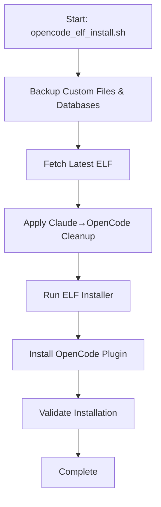

# OpenCode-ELF Workflow Guide

This guide provides a clear, step-by-step explanation of the OpenCode-ELF workflow, making it easier to understand how the system works and how to use it effectively.

## 🎯 Overview

The OpenCode-ELF integration provides a seamless way to synchronize the Emergent-Learning-Framework_ELF with OpenCode compatibility, automatically removing Claude references and applying necessary patches.

## 📊 Simplified Workflow Visualization



## 🚀 Simplified Step-by-Step Workflow

### 1. **Backup Phase**
- **Actions**: Backup custom files AND databases
- **Purpose**: Preserve modifications and data before updates
- **Files backed up**: Custom configurations, scripts, and database files

### 2. **Fetch Latest ELF**
- **Action**: `git fetch origin` + `git reset --hard origin/main`
- **Purpose**: Get clean upstream version
- **Note**: Discards local changes (safe due to backup)

### 3. **Apply Claude→OpenCode Cleanup**
- **Actions**:
  - Text replacement: Claude → OpenCode
  - File renaming: .claude → .opencode
  - Path normalization
- **Files affected**: Python, JS, shell scripts, markdown, etc.

### 4. **Run ELF Installer**
- **Action**: Execute ELF installation script
- **Purpose**: Install updated ELF framework
- **Includes**: Database schema initialization

### 5. **Install OpenCode Plugin**
- **Plugin**: `ELF_superpowers_plug.js`
- **Location**: `$OPENCODE_DIR/plugins/` (not plugin)
- **Purpose**: Provide OpenCode integration with ELF

### 6. **Validate Installation**
- **Checks**:
  - ELF installation location
  - Plugin installation
  - Reference cleanup verification
- **Output**: Final validation report

## 🔧 Key Components

### Main Scripts
| Script | Purpose | When to Use |
|--------|---------|-------------|
| `opencode_elf_install.sh` | Main installer | First time & regular updates |
| `opc-elf-sync.sh` | Core synchronization | Manual sync operations |
| `validate-setup.sh` | System checks | Troubleshooting |
| `diagnose-git-state.sh` | Git health check | When issues occur |
| `clean-installed-claude-refs.sh` | Cleanup | Post-installation |

### Environment Variables
```bash
# Default values (can be customized)
OPENCODE_DIR="$HOME/.opencode"
ELF_BASE_PATH="$OPENCODE_DIR/emergent-learning"
```

### Patch System
- **Location**: `scripts/patches/`
- **Types**:
  - `src-claude-cleanup.patch` - Claude reference removal
  - `launcher-openai.patch` - OpenAI launcher support
  - `opencode-plugin.patch` - OpenCode plugin integration

## 🛠️ Troubleshooting Guide

### Common Issues & Solutions

**Issue**: Patch fails during sync
**Solution**:
```bash
# 1. Check upstream changes
cd Emergent-Learning-Framework_ELF && git log --oneline -5

# 2. Review file changes
git diff HEAD~1 src/watcher/launcher.py

# 3. Update patch file
diff -u original/ modified/ > scripts/patches/filename.patch

# 4. Re-run sync
./scripts/opc-elf-sync.sh
```

**Issue**: Divergent git branches
**Solution**:
```bash
./scripts/reset-elf-repo.sh
```

**Issue**: Database integrity problems
**Solution**:
```bash
OPENCODE_DIR=$HOME/.opencode ELF_BASE_PATH=$HOME/.opencode/emergent-learning \
bash ./scripts/fix-database.sh
```

## 📚 Best Practices

1. **Regular Updates**: Run `opencode_elf_install.sh` regularly
2. **Backup First**: Always backup before major changes
3. **Check Validation**: Use `validate-setup.sh` before troubleshooting
4. **Environment Variables**: Customize paths as needed
5. **Review Logs**: Check backup directories for previous states

## 🎓 Advanced Usage

### Custom Patches
```bash
# Create custom patch
./scripts/preserve-customizations.sh backup

# Modify files as needed

# Generate patch
./scripts/preserve-customizations.sh patch
```

### Manual Sync
```bash
# When you need more control
./scripts/opc-elf-sync.sh
```

### Database Repair
```bash
# For schema issues
OPENCODE_DIR=$HOME/.opencode ELF_BASE_PATH=$HOME/.opencode/emergent-learning \
bash ./scripts/fix-database.sh
```

## 🔄 Update Cycle

1. **Backup** → 2. **Fetch** → 3. **Reset** → 4. **Restore** → 5. **Patch** → 6. **Clean** → 7. **Install** → 8. **Validate**

This cycle ensures safe, reliable updates while preserving your customizations.

## 📖 Additional Resources

- `QUICK_START.md` - Getting started guide
- `SETUP_CHECKLIST.md` - Manual verification steps
- `IMPLEMENTATION_SUMMARY.md` - Technical architecture
- `Spec.md` - Detailed specifications
- `VERIFICATION_REPORT.md` - Testing results